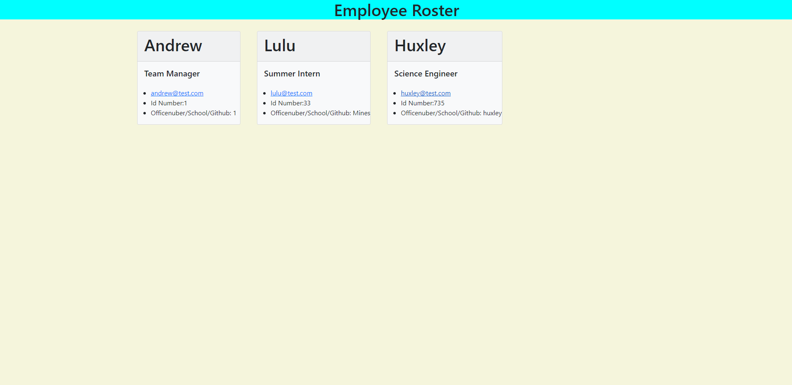

# Create An Employee Roster With a Few Questions

MIT License

## Description

By answering a few questions using inquirer, you can generate an roster.html with your input. You can add as many employees you like based on three categories of manager, intern, and engineer. They will all be dynamically placed into the html with the info that you have input.

[Here is a video demo of the the app!](https://drive.google.com/file/d/1uBq5CCNiHdtXZjQtsnyFw_IGWTLikvWr/view?usp=sharing)

## Table of Contents

[1. Description](#description)

[2. Installation Instructions](#installation-instructions)

[3. Usage Information](#usage-information)

[4. Contribution Guidelines](#contribution-guidelines)

[5. Test Instructions](#test-instructions)

[6. Questions](#questions)

[7. License](#license)

## Installation instructions

To install this app do a gitclone from my github page. Then do a command npm i in the terminal to install the nescarry dependencies required to run the app.

## Usage Information

To run the app once it is installed all you will need to do is run the command node node index.js which will start the prompts for questions. Then answer the questions as follows and after the html page will be generated!

## Contribution Guidelines

Please contact me for the guidelines on contributions.

## Test instructions

I am using jest to test my project. To run the tests I have set up, run the command npm test.

## Questions

[Link to my Github](https://github.com/awfiscus)

awfiscus@comcast.net

If you have any questions reguarding the project please contact me by email.

## License

MIT License

    Copyright (c) [year] [fullname]

    Permission is hereby granted, free of charge, to any person obtaining a copy
    of this software and associated documentation files (the "Software"), to deal
    in the Software without restriction, including without limitation the rights
    to use, copy, modify, merge, publish, distribute, sublicense, and/or sell
    copies of the Software, and to permit persons to whom the Software is
    furnished to do so, subject to the following conditions:

    The above copyright notice and this permission notice shall be included in all
    copies or substantial portions of the Software.

    THE SOFTWARE IS PROVIDED "AS IS", WITHOUT WARRANTY OF ANY KIND, EXPRESS OR
    IMPLIED, INCLUDING BUT NOT LIMITED TO THE WARRANTIES OF MERCHANTABILITY,
    FITNESS FOR A PARTICULAR PURPOSE AND NONINFRINGEMENT. IN NO EVENT SHALL THE
    AUTHORS OR COPYRIGHT HOLDERS BE LIABLE FOR ANY CLAIM, DAMAGES OR OTHER
    LIABILITY, WHETHER IN AN ACTION OF CONTRACT, TORT OR OTHERWISE, ARISING FROM,
    OUT OF OR IN CONNECTION WITH THE SOFTWARE OR THE USE OR OTHER DEALINGS IN THE
    SOFTWARE.

[MIT License Link](https://choosealicense.com/licenses/mit/)
